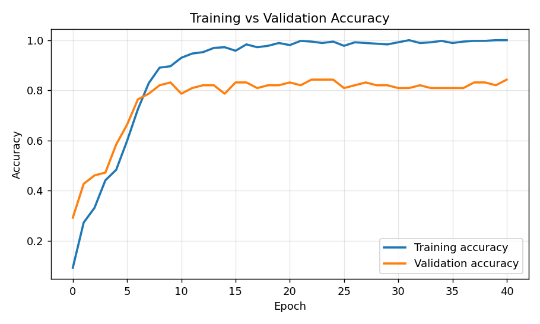
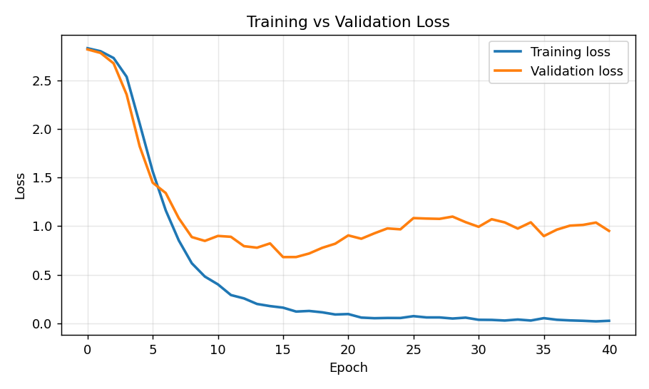

# Project Report

## 1. Title
**Online Voice-Enabled Chatbot using Speech Recognition and Deep Learning**

## 2. Abstract
This project builds a web-based chatbot that users talk to through their computer's microphone. The web app is built with Streamlit. Its microphone widget (`st.audio_input`) records live audio in the browser as a 16 kHz WAV, and a speech recognition service converts it to text. The text is classified into one of 17 intents by a deep learning model made of a word Embedding layer, a Bidirectional LSTM, a Dense layer, Dropout and a Softmax output. A response for the predicted intent is returned and shown on the page together with the recognized text, the predicted intent and the model's confidence; the browser can also read the response aloud. On a stratified 20 % validation split of a custom 445-sentence dataset, the model reached **83.15 % validation accuracy** (99.72 % training accuracy). The application is hosted on GitHub and deployed on Streamlit Community Cloud, which provides the HTTPS connection that browsers require for microphone access. An alternative FastAPI + HTML/JavaScript frontend implementing the same pipeline is also included.

## 3. Problem Statement
Typed chatbots are slow for many users and inaccessible to some (for example people with limited typing ability, or users who are on the move). Institutions such as colleges receive the same questions repeatedly — courses, fees, admissions, timings. The problem is to build an assistant that (a) accepts natural spoken questions directly from a microphone in a web browser, (b) understands the *intent* of the question even when it is phrased in different ways, and (c) responds instantly in text and speech — while being deployable publicly over HTTPS.

## 4. Objectives
1. Capture live microphone audio in the browser (no file upload) with proper permission handling.
2. Convert speech to text on the server.
3. Build and train an Embedding + BiLSTM intent classifier on a custom `intents.json` dataset.
4. Return the intent, a confidence score and a suitable response; ask the user to repeat when confidence is low.
5. Display Recognized Speech, Detected Intent, Confidence and Chatbot Response; provide text-to-speech playback.
6. Keep training separate from serving (the model is loaded, never retrained, by the web app).
7. Deploy publicly with HTTPS and document every step.

## 5. Dataset
A custom college-helpdesk dataset, `backend/intents.json`, written for this project.

| Property | Value |
|---|---|
| Intents | 17 |
| Patterns (training sentences) | 445 (25–29 per intent) |
| Responses | 1–3 per intent |
| Train / validation split | 356 / 89 (stratified 80 / 20, seed 42) |

Intents: `greeting`, `how_are_you`, `goodbye`, `thanks`, `bot_name`, `capabilities`, `help`, `courses`, `working_hours`, `contact`, `admission`, `fees`, `location`, `library`, `hostel`, `placements`, `exams`.

Each intent has the form:
```json
{ "tag": "courses",
  "patterns": ["tell me about courses", "what courses are offered", "..."],
  "responses": ["We offer B.Tech programs in ..."] }
```
Patterns are written the way people *speak* (lower-case, no punctuation, contractions such as "what's"), because the model's input comes from speech recognition. Contact details, fees and statistics in the responses are demo values.

## 6. Speech Recognition Method
- **Capture (browser, deployed Streamlit app):** Streamlit's built-in `st.audio_input` widget calls the browser's `getUserMedia` API, which shows the microphone permission prompt. It records live while showing a waveform and timer, and returns the recording as a **16 kHz WAV** (`sample_rate=16000`) to the Python app when the user clicks stop. No file is chosen or uploaded by the user.
- **Capture (alternative FastAPI frontend):** `script.js` calls `getUserMedia` with echo cancellation, noise suppression and automatic gain enabled. An **AudioWorklet** node receives raw 32-bit float samples (falling back to a `ScriptProcessorNode` in older browsers), with a live level meter and a 15 s auto-stop.
- **Encoding (alternative frontend only):** on Stop, the samples are merged, down-sampled to **16 kHz** by block averaging (which also acts as a simple low-pass filter), and written as a **16-bit PCM mono WAV** with a 44-byte RIFF header. Producing WAV in the browser means the server needs no ffmpeg conversion, and the output is identical in Safari and Chrome. MediaRecorder, by contrast, outputs WebM/Opus in Chrome but MP4/AAC in Safari.
- **Validation (server):** the WAV header is parsed. Recordings shorter than 0.4 s are rejected as *empty*, and recordings whose RMS energy is below 60 (16-bit scale) are rejected as *silent*.
- **Speech-to-Text (server):** the `SpeechRecognition` library sends the audio to the **Google Web Speech API** (`recognize_google`, language `en-US`, configurable via the `STT_LANGUAGE` env variable, e.g. `en-IN`). This is a cloud acoustic + language model (deep neural network) that returns the most likely transcript. If nothing intelligible is found, the error `speech_not_recognized` (HTTP 422) is returned; if the service is unreachable, `stt_service_error` (HTTP 503) is returned. The application never invents a transcript.

## 7. Data Preprocessing
1. **Cleaning** – lower-case; keep only `a–z`, `0–9` and apostrophes; collapse spaces (`"What's the FEE?"` → `"what's the fee"`).
2. **Tokenization** – split on whitespace into words.
3. **Vocabulary** – built from the *training split only*, so no validation words leak into it. Words are sorted by frequency; index 0 = `<PAD>`, 1 = `<OOV>` (out-of-vocabulary). Size: **300**.
4. **Sequencing** – every word is replaced by its index; unknown words map to 1.
5. **Padding** – sequences are post-padded with zeros to **max_len = 12** (longest training sentence + 4). Longer inputs are truncated.
6. **Label encoding** – intent tags sorted alphabetically and mapped to integers 0–16 (`model_metadata.json` stores both directions).

The same code (`backend/nlp_utils.py`) is used by training and by the server, so inference preprocessing is guaranteed to match training.

## 8. Deep Learning Architecture

```
Input: 12 word indices
  │
  ▼
Embedding (300 × 64, mask_zero=True)     16,384 params   → 12 × 64 word vectors, padding masked
  │
  ▼
Bidirectional LSTM (64 forward + 64 backward)  66,048 params → 128-d sentence vector
  │
  ▼
Dense (64, ReLU)                          8,256 params
  │
  ▼
Dropout (0.5)                             0 params  (only active during training)
  │
  ▼
Dense (17, Softmax)                       1,105 params   → probability of each intent
────────────────────────────────────────────────────────
Total trainable parameters: 94,609
```

- **Embedding:** learns a dense 64-dimensional vector for each word, so that words used in similar contexts (e.g. *fee*, *cost*, *tuition*) end up with similar vectors. `mask_zero=True` tells the LSTM to ignore padding.
- **LSTM:** a recurrent layer whose input, forget and output gates let it keep useful information across the whole sentence, capturing word order (*"when do exams start"* vs. *"exam start when"*).
- **Bidirectional:** one LSTM reads left→right and another right→left; their final states are concatenated. This way a word is interpreted with both its preceding and following context, which helps with short questions whose key word may appear at the end (*"… the library"*).
- **Dense + ReLU:** combines the sentence features non-linearly.
- **Dropout 0.5:** randomly zeroes half the activations during training to reduce over-fitting on the small dataset.
- **Softmax:** converts the 17 output scores *zᵢ* into probabilities *pᵢ = e^{zᵢ} / Σⱼ e^{zⱼ}* that sum to 1.
- **Loss / optimiser:** sparse categorical cross-entropy, Adam (learning rate 0.001), batch size 16, up to 200 epochs with **early stopping** on validation loss (patience 25, best weights restored).

**Confidence and prediction:** the predicted intent is `argmax(p)` and the **confidence is that maximum softmax probability**. If confidence < **0.60**, or none of the words are in the vocabulary, the bot replies *"I'm not sure I understood that. Could you please say it again?"* Otherwise a response is picked at random from that intent's `responses` list.

## 9. System Architecture

```
┌──────────────────── Browser (Mac: Safari / Chrome) ─────────────────────┐
│  🎤 st.audio_input → getUserMedia (permission prompt) → live recording   │
│  ⏹ stop → 16 kHz WAV sent to the Streamlit server (WebSocket)            │
│  ◄── page re-renders: Recognized Speech · Intent · Confidence · Response │
│  🔊 Play Response → browser speechSynthesis                               │
└───────────────────────────────────┬──────────────────────────────────────┘
                                    │ HTTPS (Streamlit Community Cloud)
┌───────────────────── streamlit_app.py (Python server) ──────────────────┐
│ speech_to_text.py : WAV check (length, silence) → Google Web Speech → text│
│ nlp_utils.IntentClassifier : clean → tokenize → pad → BiLSTM → softmax    │
│ response selection from intents.json                                      │
│ Loaded once (st.cache_resource): chatbot_model.keras, model_metadata.json │
└───────────────────────────────────────────────────────────────────────────┘
Offline, separately:  train_model.py → chatbot_model.keras + model_metadata.json + plots
Alternative: frontend/ (HTML/JS, Web Audio) → POST /process-audio → backend/app.py (FastAPI)
               → the same speech_to_text.py + nlp_utils.py
```

## 10. Methodology
1. **Requirement analysis** – live microphone input, deep learning NLU, HTTPS deployment.
2. **Dataset creation** – 17 intents in a college domain, phrased as spoken language; expanded from 265 to 445 patterns after the first training run showed poor generalisation (validation accuracy 67.9 %).
3. **Model development** – preprocessing, BiLSTM training with a stratified split, early stopping, evaluation, saved artefacts.
4. **Application** – Streamlit app with speech-to-text, validation and error messages; model loaded once and cached. An alternative FastAPI backend exposes the same pipeline as `POST /process-audio`.
5. **Frontend** – microphone capture, WAV encoding, state display, error messages, TTS.
6. **Testing** – unit/API tests with pytest, 12 demonstration cases, an end-to-end browser test with a simulated microphone.
7. **Deployment** – GitHub repository deployed on Streamlit Community Cloud (HTTPS).

## 11. Implementation
| Component | Technology | File |
|---|---|---|
| Web app (deployed) | Streamlit 1.64 (`st.audio_input`, `st.cache_resource`), browser SpeechSynthesis | `streamlit_app.py` |
| Alternative UI | HTML5, CSS3, JavaScript (Web Audio API, Fetch, SpeechSynthesis) | `frontend/*` |
| Alternative API | FastAPI, Uvicorn | `backend/app.py` |
| Speech-to-Text | SpeechRecognition → Google Web Speech API | `backend/speech_to_text.py` |
| NLP + inference | NumPy, TensorFlow 2.21 / Keras 3 | `backend/nlp_utils.py` |
| Training | TensorFlow/Keras, scikit-learn, Matplotlib | `backend/train_model.py` |
| Tests | pytest, FastAPI TestClient, Streamlit AppTest, Playwright | `tests/*` |
| Deployment | GitHub, Streamlit Community Cloud | `requirements.txt`, `streamlit_app.py` |

UI states: microphone permission prompt → recording (waveform + timer) → **⏳ Processing…** → **🟢 Response ready** (low confidence shown as a warning, ❌ for errors).

## 12. Results
All figures below come from the actual training run (`backend/training_report.json`). Training stopped at epoch 41, and the weights from the best epoch (16) were restored.

| Metric | Value |
|---|---|
| Training accuracy | **99.72 %** |
| Validation accuracy | **83.15 %** |
| Training loss | **0.0332** |
| Validation loss | **0.6809** |
| Validation macro precision / recall / F1 | 0.867 / 0.831 / 0.826 |

Accuracy curve (`backend/plots/accuracy.png`):



Loss curve (`backend/plots/loss.png`):



**Interpretation:** training accuracy approaches 100 % while validation accuracy plateaus at about 82–84 %. After epoch 16 the validation loss rises again, which is a sign of over-fitting on a small dataset; early stopping restores the epoch-16 weights. The weakest validation classes were `how_are_you` (recall 0.40) and `placements` (precision 0.50), because several validation sentences use words that never occur in the training split, such as *holding up* and *salary*. More training phrases per intent would give the biggest improvement.

## 13. Testing

**Automated tests (`pytest -q`): 23 passed.** One is a Streamlit smoke test that starts the app and checks that the model loads. They cover the health check, the homepage being served, the 12 demo cases, a gibberish input handled as low confidence, and the full `/process-audio` pipeline with real WAV bytes. That includes the success path, empty recording, too-short recording, silent recording, invalid audio, speech not recognized, and speech-service failure. In these tests only the network call to Google is replaced, so they run offline.

**End-to-end browser tests:** headless Chromium with a simulated microphone. *Streamlit app:* the microphone widget recorded **3.0 s at 16 kHz**, and the page displayed *Recognized Speech → working_hours → 100.0 % → response* with the Play button. *Alternative FastAPI frontend:* the page requested the microphone, recorded, and sent a **2.57 s, 16 kHz WAV (RMS 7280)** to the server, then displayed *Recognized Speech → courses → 99.6 % → response*. A denied permission showed the correct error message. The Google call was stubbed here because the test environment had no access to Google.

**Demonstration test cases** (`python tests/test_cases.py`). The *Predicted intent* and *Confidence* columns are real model outputs for the recognized text shown. When you demo live, the recognized text comes from Google STT and may differ slightly, for example in punctuation or capitalisation, which the preprocessing removes.

| # | Input voice (spoken) | Recognized text | Predicted intent | Confidence | Chatbot response (one of the responses) | Status |
|---|---|---|---|---|---|---|
| 1 | "Hello" | Hello | greeting | 91.9 % | Hi there! What can I do for you? | PASS |
| 2 | "What is your name?" | What is your name | bot_name | 99.9 % | I'm VoiceBot, a voice-enabled college assistant… | PASS |
| 3 | "Can you help me?" | Can you help me | help | 80.5 % | Of course! Tell me what you need… | PASS |
| 4 | "Thank you" | Thank you | thanks | 93.3 % | Glad I could help! | PASS |
| 5 | "Goodbye" | Goodbye | goodbye | 67.5 % | Goodbye! Have a great day. | PASS |
| 6 | "Tell me about courses" | Tell me about courses | courses | 99.7 % | We offer B.Tech programs in Computer Science… | PASS |
| 7 | "What are your working hours?" | What are your working hours | working_hours | 100.0 % | The college office is open Monday to Friday… | PASS |
| 8 | "How can I contact you?" | How can I contact you | contact | 100.0 % | You can reach the college office at +91-… | PASS |
| 9 | "What can you do?" | What can you do | capabilities | 98.8 % | I can answer questions about courses, admissions… | PASS |
| 10 | "How much is the fee for B.Tech?" | How much is the fee for B.Tech | fees | 100.0 % | The B.Tech tuition fee is approximately ₹1,50,000… | PASS |
| 11 | "Is there a hostel for girls?" | Is there a hostel for girls | hostel | 99.9 % | Separate hostels are available for boys and girls… | PASS |
| 12 | "What's the weather like on Mars?" (unknown) | What's the weather like on Mars | unknown (closest: location) | 49.7 % | I'm not sure I understood that. Could you please say it again? | PASS |
| 13 | (press Start then Stop immediately) | – | – | – | ❌ "Empty recording – press Start, speak your question, then press Stop." | PASS |
| 14 | (block microphone permission) | – | – | – | ❌ "Microphone permission was denied…" | PASS |

**12 / 12 intent test cases passed**, and both error cases were handled correctly.

## 14. Deployment
- Source code, dataset and the trained model (about 1.2 MB) are hosted in a public **GitHub** repository.
- The app is deployed on **Streamlit Community Cloud** (free): main file `streamlit_app.py`, Python 3.12, dependencies from `requirements.txt`. The site is served at `https://<app-name>.streamlit.app`.
- Every commit to `main` redeploys the app automatically.
- **Why HTTPS:** browsers expose `getUserMedia` only in secure contexts (`https://` or `http://localhost`), so that no network attacker can inject a page that silently listens through the user's microphone. Streamlit Community Cloud serves every app over HTTPS, so the permission prompt works.
- The alternative FastAPI version can be deployed with the included `Dockerfile` on any Docker host.

Exact step-by-step instructions are in `README.md` §4.

## 15. Advantages
- Hands-free, natural interaction directly from the browser, with no installation for the user.
- Works on Safari, Chrome, Edge and Firefox on macOS/Windows. Using a WAV format built in the browser avoids codec differences between them.
- The BiLSTM understands paraphrases rather than exact keywords, and the confidence score is shown for transparency.
- A low-confidence fallback prevents confidently wrong answers in most cases.
- Small model (95 k parameters, about 1 MB) with fast inference (tens of milliseconds on CPU).
- Training and serving are separated, and the preprocessing code is shared between them.
- Clear error handling for every failure point, plus automated tests.

## 16. Limitations
- **Speech-to-text depends on Google's free Web Speech API** (internet needed, usage limits, audio leaves the server). It is suitable for a demo, not for production.
- **Small, single-domain dataset:** validation accuracy is 83 %, and phrasing far from the training data can be misclassified.
- **Closed-set softmax:** the model must choose one of the 17 intents, so an off-topic question that shares words with an intent can still pass the threshold. For example, "what is the capital of France" was classified as `location` with 60.0 % confidence.
- Responses are fixed templates. There is no conversation memory or entity extraction (e.g. which course is being asked about).
- English only. Push-to-talk rather than continuous listening.
- Streamlit reruns the whole script on every interaction, so the UI is less customisable than the HTML/JS version.
- Free Streamlit Community Cloud apps sleep after a few days without visitors and need about a minute to wake up.

## 17. Future Scope
- Replace Google STT with an on-server model (Whisper / Vosk) for privacy and offline use.
- Use pre-trained embeddings (GloVe/fastText) or a Transformer (DistilBERT) for better generalisation; collect real user queries to enlarge the dataset.
- Add an explicit *out-of-scope* class and calibrated confidence.
- Named-entity extraction and multi-turn dialogue state (e.g. "fees for *MBA*").
- Multilingual support (Hindi, Tamil), with automatic language detection.
- Continuous listening with voice-activity detection, and streaming recognition over WebSockets.
- Admin panel for editing intents and retraining.

## 18. Conclusion
The project delivers a complete, publicly deployable voice chatbot. Live microphone audio is captured in the browser, converted to text, and classified by an Embedding + BiLSTM neural network trained on a custom dataset; the answer is returned in text and speech. The model reaches 99.7 % training and 83.2 % validation accuracy on 17 intents, all 12 demonstration cases behave as expected, and every failure mode (permission denied, no microphone, empty or silent audio, unrecognized speech, service or backend unavailable, low confidence) is handled with a clear message. Deployment on Streamlit Community Cloud provides the HTTPS connection that microphone access requires.

## 19. References
1. Hochreiter, S., & Schmidhuber, J. (1997). *Long Short-Term Memory.* Neural Computation, 9(8), 1735–1780.
2. Schuster, M., & Paliwal, K. K. (1997). *Bidirectional Recurrent Neural Networks.* IEEE Transactions on Signal Processing, 45(11), 2673–2681.
3. Srivastava, N. et al. (2014). *Dropout: A Simple Way to Prevent Neural Networks from Overfitting.* JMLR, 15, 1929–1958.
4. Kingma, D. P., & Ba, J. (2015). *Adam: A Method for Stochastic Optimization.* ICLR.
5. TensorFlow / Keras documentation – https://www.tensorflow.org, https://keras.io
6. SpeechRecognition library – https://github.com/Uberi/speech_recognition
7. MDN Web Docs – *MediaDevices.getUserMedia()*, *Web Audio API*, *Secure contexts*, *SpeechSynthesis* – https://developer.mozilla.org
8. FastAPI documentation – https://fastapi.tiangolo.com
9. Streamlit documentation – `st.audio_input`, Community Cloud deployment – https://docs.streamlit.io
